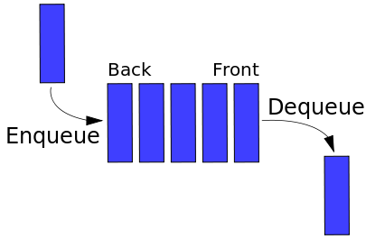

# Queue

## Description

A queue is a data structure that can store or retrieve one item at a time, in first-in-first-out (FIFO) order. Think of FIFO as standing in the line at the grocery store. You would expect the first person that stood in the line to be the first one served by the cashier.

Queue implements FIFO through two operations; `enqueue` and `dequeue`, which can be visualized in the diagram below:



- `enqueue` operation stores the item at the back of the queue.
- `dequeue` operation retrieves the item from the front of the queue.

(_In the diagram above, the right side is the front, and the left is the back. However, the same operations are applied even when the direction is reversed_)

## Implementation

In this exercise, implement the following functions for the `Queue` class

- `isEmpty()`
  - Write a method that returns `true` if the queue is currently empty, and false otherwise.
- `peek()`
  - Write a method that returns the element at the front of the queue, or returns null if the queue is empty.
- `enqueue(el)`
  - Write a method that adds an element(`el`) to the back of the queue.
- `dequeue()`
  - Write a method that removes an element from the front of the queue, and returns it.  It should return null if the queue is empty.
- `toString()`
  - The stringify method is provided for you. `toString()` is a useful method to implement into data structures for easier debugging.
  - For example, you could use it for logging:
    ```
    const queue = new Queue();
    console.log(queue.toString());
    ```
  - A queue is simple enough to be logged without actually needing `toString()`, but with more complex data structures, this is an invaluable method.

## Queue Exercises

**Stack Queue**

(Solve this exercise after finishing the stack exercise).

Implement a queue using stacks.  Instead of using an array as your store, use a stack:
```
import Stack from '../stack/Stack'


export default class QueueS {
  constructor() {
    this.store = new Stack();
    this.otherStack =  new Stack();
  } 

etc.
```


There are (at least) two ways to implement a queue. One way makes inserting very cheap, but makes popping and peeking expensive.  The other makes popping and peeking very cheap, but makes inserting harder.  Try to implement both ways.  In both implementations, some operations require touching every objects that is stored.  We say an algorithm that touches every object in the data structure is linear (or worse) or, in big O notation, O(n).  An operation that can be completed in the same amount of steps, no matter how many objects are in the data struturem is said to be constant, or O(1).  

Ideally, in a Queue, the operations isEmpty, peek, enqueue, and dequeue should be constant or O(1).  Whether or not the sample implementation is constant depends on the complexity of the underlying operations.  An implementation that uses C arrays underneath should be O(1) almost all the time, save when it needs to re-allocate memory (as the array has grown or n elements have been unshifted). Re-allocating memory and copying is O(n), as it needs to touch every piece of data.  


**Queue Stack**

Now implement a stack using just one queue. 

peek, pop, and isEmpty are easy.  The trick is to find a way to implement push so that the other functions work.  As a hint, consider what would need to happen for the last element added to be the next element to be dequeued.  All the other elements would need to be enqueued after it.  This is another example of one function being linear, in this case enqueue, and the others being O(1).


```import Queue from "./Queue";
import Stack from "../stack/Stack";

export default class StackQ {
  constructor() {
    this.store = new Queue();
  }

etc.

```

 


