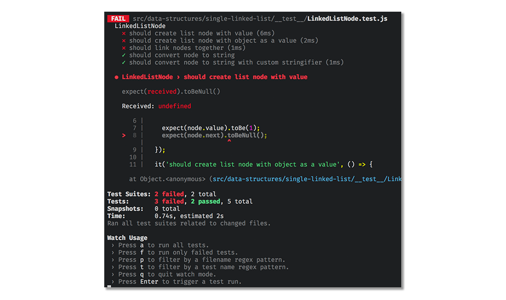
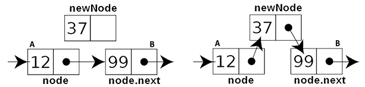
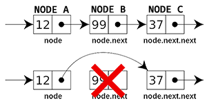

# Linked List

## Description

A linked list is a linear colletion of elements _in sequential order_. Imagine a chain, with a start and a end, with the chain links connected to each other. A linked list can be visualized as below:


A linked list is composed of a smaller data structure usually called a `Node`. The node object contains the `value` of the element itself, and also a pointer to the `next` node in the chain. By utilizing `node.next`, you can traverse the list. The beginning of a linked list is denoted with `head` and the last element is `tail`.   The 'tail' of a list may refer either to the rest of the list after the head, or to the last node in the list.  We will refer to the last node as the tail, but it is worth remembering that some people, especially those fro mthe functional programming community, consider the rest of the list the tail.

In a singly-linked list, the link is established in _one direction_ only, where the node only keeps track of the next node in the chain. This means that with a singly-linked list, you can only traverse in the direction of the tail. On the other hand, a node in a doubly-linked list keeps track of both `next` and `previous` which allows you to traverse in both directions (towards `head` and `tail`).

## Implementation

In this exercise, implement the following functions for the `LinkedListNode` and `LinkedList` classes:

- `LinkedListNode`
  - `constructor()`
    - Write a method that instantiates the node.
    - The node takes `value` and `next`.
- `LinkedList`
  - `constructor()`
    - Write a method that instantiates the list.
    - The instance variables `head` and `tail` should be set to `null`.
  - `prepend(value)`
    - Write a method that inserts the `value` at the beginning of the linked list.
  - `append(value)`
    - Write a method that inserts the `value` at the end of the linked list.
  - `delete(value)`
    - Write a method that deletes the first node that contains the `value` in the linked list.
  - `find(value)`
    - Write a method that returns the first `node` that contains the `value`.
  - `insertAfter(value, targetValue)`
    - Write a method that inserts the `node` after the `node` that contains the `targetValue`.
  - `deleteHead()`
    - Write a method that deletes the first element in the linked list.
  - `deleteTail()`
    - Write a method that deletes the last element in the linked list.

The most important operations are `prepend/append` for adding data, `delete` for removing data, and `find` for retrieving data.

## Detailed Walkthrough

Let's start by opening up a terminal window and running `npm run watch`. This will start our TDD framework that will automatically re-run the tests when you save any changes to your file.

- In your code editor, navigate to `/algorithms/src/data-structures/LinkedListNode.js`.
- In the constructor method, write `this.value = value` and save the changes.
- You will see the tests run automatically in your terminal:



> Jest Tip: If you need to filter by the exercise name, press `p`.
> (press `w` for the list of available commands).

The output tells you that three tests are failing:

- ✕ should create list node with value (10ms)
- ✕ should create list node with object as a value (2ms)
- ✕ should link nodes together
- ✓ should convert node to string
- ✓ should convert node to string with custom stringifier (1ms)

The code for the last two tests (`toString()` tests) have been provided for you in the skeleton. Your task is to make the three failing tests to pass.

### `LinkedListNode`

- The test description says `› should create list node with value`
- The output tells us where the test is failing: `expect(node.next).toBeNull();`. It also tells us `expect(received).toBeNull()` and `Received: undefined`.
- In this case, the test is `expect`ing `node.next` to be `null`. However, the test received `undefined`.
- Since `next` is undefined, let's update our `constructor()` in `LinkedListNode.js`:
  ```
  constructor(value, next = null) {
    this.value = value;
    this.next = next;
  }
  ```
- When you save the file, you should see all your tests for `LinkedListNode` pass!
- Often, many tests can depend on the same part of the code. In this case, solving for one test case solved all others.

Now, let's open up `LinkedList.js` in our editor.

### `constructor()`

- A linked list should always have a `head` and a `tail`.
- The test tells us: `expect(linkedList.head).toBeNull();`. Let's create the instance variables:
  ```
  constructor() {
    this.head = null;
    this.tail = null;
  }
  ```

### `prepend()`

- The `prepend` method inserts the item at the beginning of the list.
- Prepending an item is a simple operation:
  - Create a new `Node`.
  - Set the new `node`'s `next to be the current head node.
  - Update the `head` to point at the new node.
- We also have to consider a case where this is the first item stored in the list. In that case, we also set the tail to the same node.

### `append()`

- The `append` method inserts the item at the end of the list.
- Operations:
  - Create a new `Node`.
  - Set the tail's `next` to be the new node.
  - Update `tail` to point at the new node.
- Again, take into consideration when this is the first/last item stored in the list.

### `find(value)`

- The `find` method returns the node with the target value.
- A node can be visited by utilizing a loop and `node.next`.
- The following snippet traverses the entire list:

  ```
  let currentNode = node;

  while (currentNode.next) {
    currentNode = node.next
    console.log(currentNode.value)
  }
  ```

- Think about how the above concept can be applied to find the target node.

A simple implementation of `find` would take a single argument, the value to be found.  However, sometimes we want to find an object, and know only the value of ones of its slots.  We might have a list of employee objects with slots name, address, and employee-id.  Our `find` method should be able to return an employee object just by taking the id.  We enable this by making the single argument to find and object with two slots, `value:` and `callback:`.  If the `value:` slot is set, we use it, as normal.  If the `callback:` slot if set, it must be a function that can be applied to the nodes of the list, and which returns an object.  It should return true for the object that should be returned.  This use of callbacks is very common in javascript, so is worth practising.   


### `insertAfter(value, insertValue)`

- The `insertAfter` method stores the `insertValue` right after the node with the `value`.
- Operation:
  
  - Create a new `Node`.
  - Find the node with the target value.
  - Set the found node's `next` to the new node.
  - Set new node's `next` to the found node's `next.
  - If the node is inserted at the end, the tail needs to be set correctly.
- Utilize the previously written `find` method to find the node.

### `delete(value)`

- The `delete` method removes the first node with the specified value.
- Operations:
  
  - Traverse the list and locate the node before the target node.
  - Remove the target node that is placed after the found node.
    - In a linked list, you don't have to delete the actual node.
    - Deleting means removing the reference to that node from the list.
    - The above diagram shows that all we have to do is set the target node's previous node's `next` to point at the target node's `next`.
    - This means that we must locate the node right before the target node. Think about how you would be able to tell when the next node will be the target node.
  - Also, take into consideration if the `head` or `tail` node is the node to be deleted.
- This is the most complex operation in a linked list. Drawing the operation on paper can help you visualize the problem. Don't hesitate to reach out to #basic-algorithms channel on Slack if you are stuck.
  - You might try to use `find` to get to the node you want to delete.  This does not work.  Can you see why? 

### `deleteHead()` / `deleteTail()`

- The `deleteHead/Tail` methods are utility methods for common operations.  The `deleteTail()` function is slow. It needs to traverse the entire list.

## Time and Space Complexity Analysis

Some of the operations on linked lists take a fixed, constant amount of instructions, no matter the length of the list.  `prepend`, `append`, `inserAfter`, and `deleteHead` obviously just touch at most two nodes.  Other functions may need to look at every node in the data structure.  `find` and `delete` needs to look at every node if they are asked to find or delete a vlaue that is not there.  The last function `deleteTail` needs to traverse the entire list, as it needs to set the tail to the second last node.  As we can only go forwards, we need to travel down the entire list.

## Problems

**Find a loop in a list**

Given a list, we can ask whether there is a loop in it.  One obvious way to check is to remember each node that we visit in a hash table, and use this to see if there is a loop.  There is another way that only requires a constant amount of extra storage (in fact, it just needs to remember two nodes).  Floyd's cycle finding algorithm, as this is called, is not obvious, but it is a trick that many interviewers expect you to know.  The idea is simple.  You travel through the list at two speeds.  One traversal goes two steps for each step the other takes.  The fast traversal will eventually overtake the slow traversal if there is a loop. If there is no loop, the fast traversal will hit the end of the list.  


**Reverse a list in place**

A trick that people expect you to know is how to reverse a list in place.  When you traverse a list, from a given node, you can find the next node.  Once you have two nodes in a row, you can find the third node, and make the second node point to the first.  You can continue on, flipping the pointers backwards, so they point to the previous node, rather than the next.  This is unwise in any production system, especially if there is concurrency, and is very bad coding practice anywhere. Despite this, interviewers love asking about it.


**Palidromes**

A palidrome is a word that reads the same backwards as forwards.  "redivider" is a palidrome.  If we store each letter in a different node in a  singly linked list, the problem is, how can we tell if a list represents a palindrome.  We can reverse the list, but there are ways to do this without making a new reversed copy of the list.  First try to check for a palindrome with an extra reversed copy.  

Now try to find the length of a list, then find the middle element, then reverse the second half of the list.  You now have two lists, the original first half, and the reversed second half.  If these two lists are equal, the list is a palindrome.  You should re-reverse the second half to return the list to its original form.  
