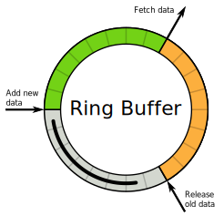

# RingBuffer

## Description

A ring buffer is a fixed-size memory data structure, often used for streams of data where the entire stream isn't needed but a small window of the stream is useful. An example would be a dashcam in a car: it does not need to have video recorded of all the driving you have ever done, but it keeps the past few hours of your driving in the event that the footage is needed (such as if you are involved in an accident and need the footage for an insurance claim). Recording all of your driving would be an enormous amount of data, whereas simply starting over at the beginning of memory and overwriting older parts of the stream is more tractable (hence the "ring" in the name, the memory is written circularly). 

A Ring Buffer is implemented essentially in two operations: `push` and `getBuffer`



- `push` inserts the latest data on top of the oldest data
- `getBuffer` returns the current window in inserted order (that is, the least-recently inserted data is first, the most recent is last)

## Implementation

In this exercise, implement the following functions for the `RingBuffer` class

- `isEmpty()`
  - Write a method that returns `true` if the RingBuffer is currently empty.
- `push(el)`
  - Write a method that stores an element(`el`) into the RingBuffer.
- `getBuffer()`
  - Write a method that returns the contents of the buffer as an array in chronologically inserted order (i.e. the most recent inserted element is last in the array)
- `toString()`
  - The stringify method has been provided for you.

## RingBuffer Exercises

**Moving Average**

Write an algorithm to calculate the moving average of a list of data with a window size of 3 elements.

```
const bracketMatch = stream => {

}

console.log(bracketMatch('{ac[bb]}') === true);
```

